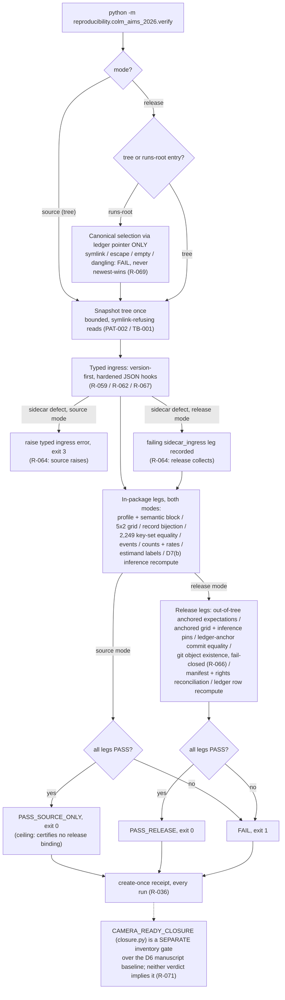

# COLM AIMS 2026 evidence verifier (v2)

> Feature: `camera-ready-aims-evidence-v2` · Branch: `feature/camera-ready-aims-v2`
> Spec: `.correctless/specs/camera-ready-aims-evidence-2.md` (71 active rules)
> Namespace usage doc: `reproducibility/colm_aims_2026/README.md`
> Architecture entries: `.correctless/ARCHITECTURE.md` PAT-002, TB-001, TB-002, ABS-001, ABS-002

## What it does

`reproducibility/colm_aims_2026/` is a two-mode, fail-closed verifier for the
ten-cell **constructed-reference** evidence package supporting the COLM 2026
AIMS workshop camera-ready. The package under verification is a
constructed QA reference sensitivity diagnostic — the pinned semantic block
(spec R-001) declares `supports: reference_sensitivity_diagnostic` and
`does_not_support: actual_decision_preservation_or_format_effect`, and every
rendered output carries that qualification (R-027).

The verified package is a single tree holding:

- a strict v2 profile (`schema_version: 2`, profile ID
  `colm_aims_constructed_reference_v2`) with the frozen 5×2 grid — five
  constructed references × two calibration maps (`shared`,
  `format_specific`) = ten cells (R-040);
- exactly one `records/<cell_id>.jsonl` per cell (R-041), each cell holding
  exactly 2,249 complete paired item keys, byte-identical across cells
  (R-042);
- canonical `FINITE_STOP` / `NEVER_STOPPED` event records (R-045..R-047);
- the in-profile D7(b) inference block — one shared bootstrap resample
  matrix, derived seed, per-cell intervals and p-values, and the m=10 Holm
  family (R-050..R-057);
- a presentation manifest and rights inventory (R-026, R-035).

The verifier is greenfield v2 code on canonical `main`, written under an
externally signed contract freeze; it is distinct from
`scripts/verify_audit_release.py` (the legacy audit-release checker, which
stays byte-identical, R-018).

## How to use it

From the repository root (documented invocation, R-037):

```bash
# Source mode — in-package consistency only; ceiling is PASS_SOURCE_ONLY
python -m reproducibility.colm_aims_2026.verify \
    --mode source --tree PATH/tree --receipts-dir PATH/receipts

# Release mode over an explicit tree — requires out-of-tree expectations
python -m reproducibility.colm_aims_2026.verify \
    --mode release --tree PATH/tree \
    --expectations PATH/expectations.json --receipts-dir PATH/receipts

# Release mode over a runs site — canonical selection via the ledger pointer
python -m reproducibility.colm_aims_2026.verify \
    --mode release --runs-root SITE/runs \
    --expectations SITE/expectations.json --receipts-dir SITE/receipts
```

- `--tree` and `--runs-root` are mutually exclusive; `--runs-root` is
  release-only and resolves the canonical package exclusively through the
  ledger's `canonical_run_id` pointer — symlinked, escaping, empty, or
  dangling targets fail the release run; newest-wins never happens (R-069).
- Unknown flags and abbreviated flags are usage errors (`allow_abbrev=False`,
  R-022). Exit codes are pinned: `0` mode-ceiling pass, `1` gate FAIL, `2`
  usage/config error, `3` typed ingress error, `4` internal error (R-037).
- Every run — including failing and refusal runs — emits a create-once,
  schema-versioned JSON receipt into `--receipts-dir`, outside the verified
  tree (R-036).

## Configuration surface: the expectations file

Release mode consumes one configuration input: the independently anchored
expectations file, which must resolve (fully, symlink-free) **outside** the
verified tree (R-013). Its top-level keys are a closed set:

| Key | Role |
|-----|------|
| `schema_version` | `2`, checked by the single bool-safe version checker (R-058/R-059) |
| `anchor` | CLOSED block, all keys required: `source_commit`, `ledger_path`, `ledger_sha256`, `external_claim_ids` (R-063) |
| `tree_files` | expected path → SHA-256 map over the tree |
| `rights_inventory` | rights declarations for every included path (R-026) |
| `bindings` | the per-leg release pins (R-012), including `bindings.grid` (reference/calibration/cell IDs, record-file map, item-key-set digest, held-fixed identities — R-044) and `bindings.inference` (seed, seed derivation, keyset digest, item-order digest, resample-matrix digest — R-052/R-053) |

Two properties matter more than any individual field: unknown keys in any
trusted block are typed errors, never silently-defaulted lookups (R-063),
and the in-package `grid`/`inference` blocks are never their own release
oracle — release legs compare package state against the expectations pins
field by field (R-044).

## Verification flow



Inside the leg pipeline, every check is a guarded leg builder: an unexpected
exception inside a builder becomes that leg's FAIL, so the run always reaches
a verdict and a receipt (PAT-002). Release mode is collect-don't-halt — every
failing leg names the leg id, expected vs observed, and a remediation class
(R-012).

## Known limitations

- **Source ceiling.** `--mode source` tops out at `PASS_SOURCE_ONLY` —
  in-package consistency only. It certifies no release binding, no anchored
  expectation, no rights clearance, no archival identity, and (like every
  surface here) no observed-decision claim (R-017, R-027).
- **Release needs a live git checkout.** The anchor-commit object-existence
  leg fails when the check cannot run — `PASS_RELEASE` is unobtainable when
  `git` is unavailable, by design (R-066). Source mode only records the
  capability gap.
- **`CAMERA_READY_CLOSURE` is not yet satisfiable.** The gate's Holm row is
  satisfied only by the D7(b) regenerated outputs
  (`analysis_provenance = "d7b_regenerated_2026"`), which are produced at
  evidence-package production (Phase 4) and do not exist yet; QA-012 is
  `UNVERIFIED` and blocking for closure (R-071, R-072). Until both resolve,
  the gate correctly fails.
- **R-052 pairing-population narrowing is pending reviewer ack.** The
  bootstrap-seed input is pinned to the 2,249 complete-pair key set with zero
  in-package exclusions (the 9 upstream-unpaired items live in provenance
  documentation). This narrows the handoff-lineage definition for the frozen
  v2 package only; it is flagged RESOLVED-pending-ack for the next reviewer
  shuttle round (spec Open Questions). Nothing blocks on it.
- **NumPy exactly 2.4.6** is required for the D7(b) bit-exact procedure
  (D5/R-051); `requirements.txt` and the `.[dev]` CI environment pin it,
  while a runtime release leg and suite test enforce it.
- **Legacy ingest is deliberately minimal.** v1/historical documents parse
  only through `legacy.load_legacy_v1_document` and never certify; only the
  three captured `paper_exports` aggregate families may back an aggregate
  ledger row (R-014, R-060).

## Verification status

`/cverify` (2026-08-22): PASS — all 71 active rules implemented and tested
(69 strong / 2 adequate / 0 gaps); v2 subset 605 passed / 0 failed; full
suite 2,311 passed / 4 pre-existing skips. Report:
`.correctless/verification/camera-ready-aims-evidence-2-verification.md`.
